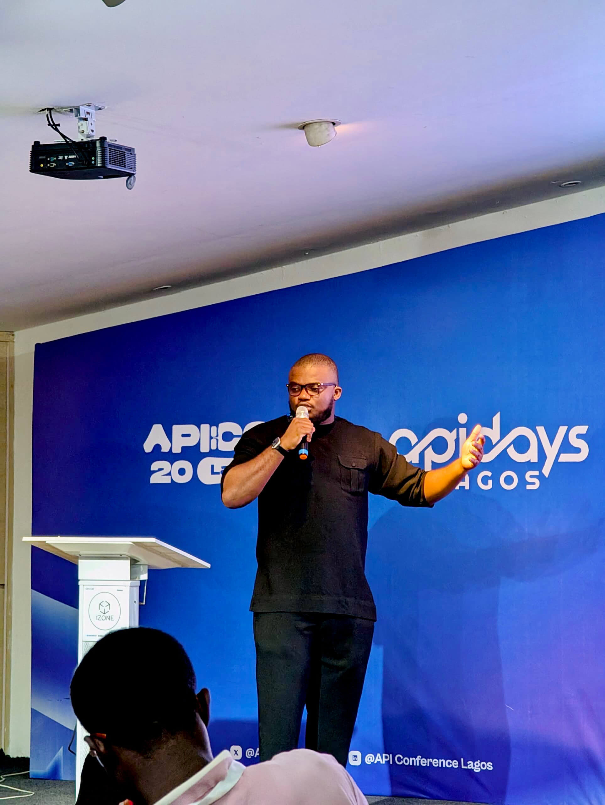
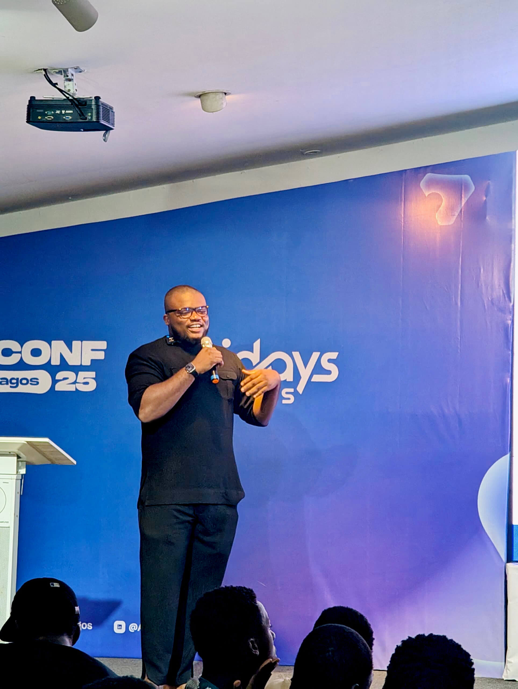
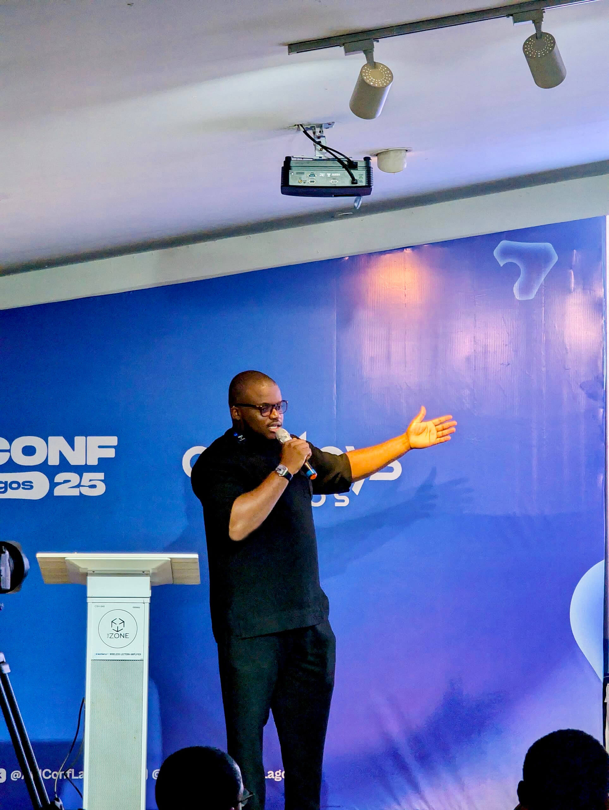

I recently had the opportunity to give a talk about "Building APIs on Cloudflare". It was fantastic diving into the potential of Cloudflare Workers and exploring:

- The reasons to build your APIs on Cloudflare
- Security, scalability, and the developer experience
- Notable services to start building with right now
- Common misconceptions, pricing, and fears

One of my biggest takeaways was realizing how excited people are to discover new technologies. After the talk, someone approached me and said they had no idea Cloudflare offered these kinds of services and they were inspired to try it out and move their website to Cloudflare just to see how easy it is. That conversation honestly made me smile days later.

**Resources:**

- [View the presentation slides](https://docs.google.com/presentation/d/1EiXTL3TEJA3L4Op4tb5pkxgRq-P2xoNzCb6vvB6aY8I/edit?slide=id.p3#slide=id.p3)
- [See the LinkedIn post](https://www.linkedin.com/posts/benjamin-daniel_cloudflare-apiconferencelagos-cloudflareworkers-activity-7356591853820928000-sltU?utm_source=share&utm_medium=member_desktop&rcm=ACoAABx0WwgBFAp7-mAjGkVMT-YeuqIZzIhnfUg)

Here are some photos from the talk:

